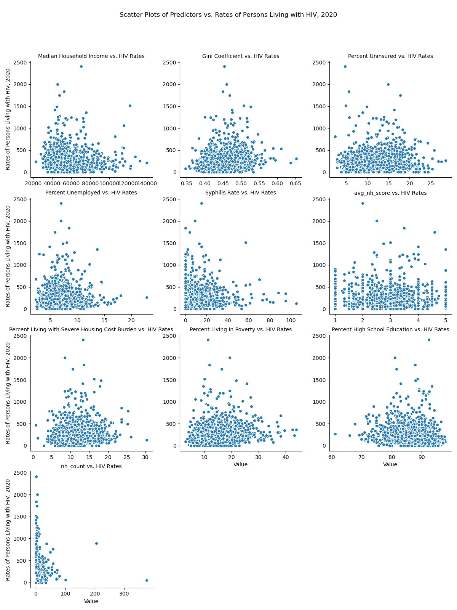
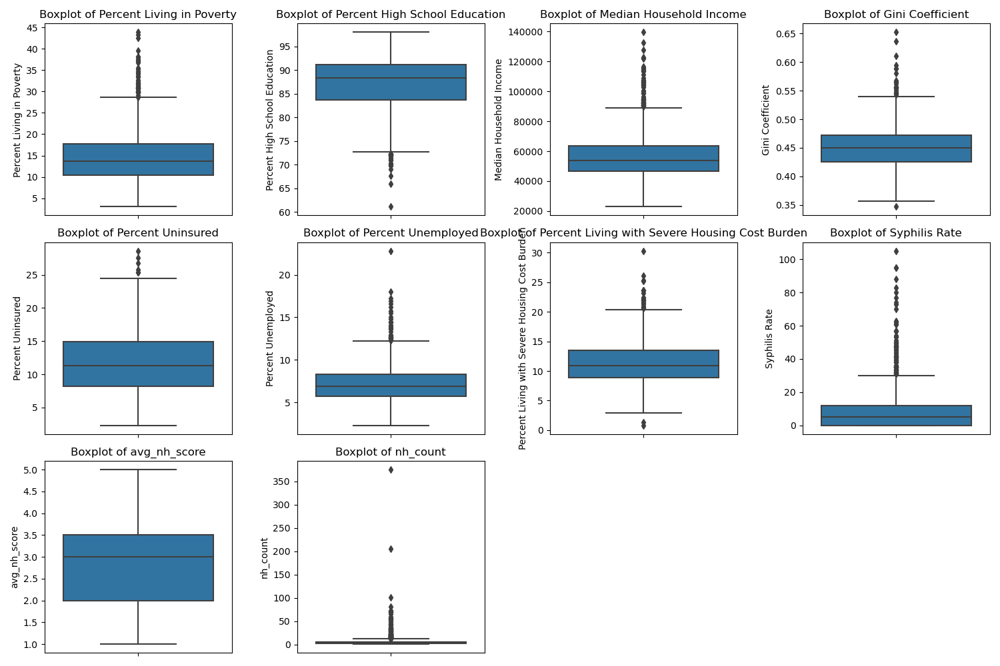
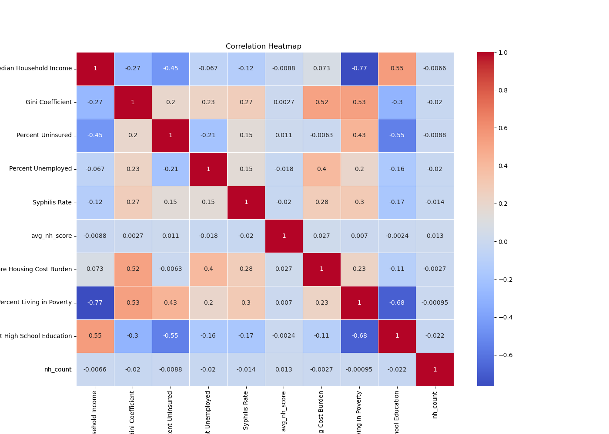

## Equitable Health Care - HIV Prevalence & Nursing Home Ratings


### Stakeholder

Prof. Brianne Olivieri-Mui, Dept of Health Sciences

### Project partners - Group 3

* Timothy Moriarity - moriarity.t@northeastern.edu
* Mohammed Shati - shati.m@northeastern.edu

### Story 

HIV and aids is a significant public health issue that has resulted in the deaths of millions of people. Medicaid is the only public insurance that pays for nursing home care. A significant portion of people living with HIV (PLWH) have Medicaid, many are also dually eligible for Medicare. Having Medicaid or Medicare means access to Part D prescription drug coverage which is mandated to cover HIV medications (they are one of the 6 protected classes of drugs). Nursing homes however do not keep these drugs on formulary because they are relatively rare and is potentially contributing to issues with antiretroviral therapy (ART) adherence in this setting. There exists publicly available data provided by Medicare.gov that ranks nursing homes on a star rating from 1 to 5, with 1 indicating the worst care and 5 indicating the best care. For this reason we are looking for a relationship between the ratings of an areas nursing homes and the prevelance of HIV in that area.

Based on this hypothesis we are looking at what if any relationship there is between a nursing home ratings and the prevelance of HIV in an area. We have a hypothesis that the higher the ratings of nursing homes in an area the lower the prevalence of HIV. If this holds true, this would support the allocation of public funds to combat HIV by raising the quality of nursing home care.


### Data

All data is publicly available. We have included the necessary files in the data folder of the repo to save time in recreation.

The data can be obtained from the list of links found in the sources.md file in the docs folder.

The necessary data can be recreated with the following command:

```
make data
```
### EDA

```
make plots
```
This scatter plot gives us a look at available features
as well as our feature of interest average nursing home score
compared with HIV prevalence rates:



This histogram shows the distributions of the features:






### Model

Building off the work done by the previous groups we were able to run a linear regression model with the key feature of interest being nursing home ratings.

We are looking to see if the rating of an areas nursing homes has an impact on HIV infections.
```
make model
```
Creates figures & results whcih are partially shown below and in full detail in the results.md file in the docs folder.
```

Linear Regression - Full Population

                                      OLS Regression Results
==================================================================================================
Dep. Variable:     Rates of Persons Living with HIV, 2020   R-squared:                       0.086
Model:                                                OLS   Adj. R-squared:                  0.081
Method:                                     Least Squares   F-statistic:                     17.32
Date:                                    Sun, 13 Aug 2023   Prob (F-statistic):           8.02e-25
Time:                                            13:52:47   Log-Likelihood:                -10036.
No. Observations:                                    1478   AIC:                         2.009e+04
Df Residuals:                                        1469   BIC:                         2.014e+04
Df Model:                                               8
Covariance Type:                                nonrobust
==================================================================================================================
                                                     coef    std err          t      P>|t|      [0.025      0.975]
------------------------------------------------------------------------------------------------------------------
Percent Living in Poverty                          6.9459      1.824      3.807      0.000       3.367      10.524
Percent High School Education                     -4.1979      0.812     -5.171      0.000      -5.790      -2.606
Median Household Income                            0.0030      0.001      4.828      0.000       0.002       0.004
Gini Coefficient                                 668.5884    192.331      3.476      0.001     291.315    1045.862
Percent Uninsured                                  2.8547      1.455      1.962      0.050       0.001       5.709
Percent Unemployed                                -7.3420      2.911     -2.522      0.012     -13.052      -1.632
Percent Living with Severe Housing Cost Burden     3.9185      2.005      1.955      0.051      -0.014       7.851
Syphilis Rate                                      0.1380      0.502      0.275      0.783      -0.846       1.122
avg_nh_score                                       2.9649      5.533      0.536      0.592      -7.889      13.819
==============================================================================
Omnibus:                     1073.939   Durbin-Watson:                   1.734
Prob(Omnibus):                  0.000   Jarque-Bera (JB):            21878.153
Skew:                           3.181   Prob(JB):                         0.00
Kurtosis:                      20.742   Cond. No.                     2.01e+06
==============================================================================

Notes:
[1] Standard Errors assume that the covariance matrix of the errors is correctly specified.
[2] The condition number is large, 2.01e+06. This might indicate that there are
strong multicollinearity or other numerical problems.


The indepth results can be found in docs folder results.md

including a recreation of this summary as well as cross validated rsquared scores, lasso feature reduction ranks, and analysis. 

```

#### Second model - Creates a model with only 55+ age group.

Command:

```
make m55
```
The results are in the results.md file. 


### Referencing

sources.md in src folder

##### We are building off the work of two previous groups.

##### Every file will have a reference to where it originated, and if it has been modified or not. 
##### This will be done by a reference to the group at the bottom of every file.

#### Group 1
* Nick Barnes
* Paige Norris
* https://github.com/ds5110/bioscience

#### Group 2 
* Amanda Haskell
* Mian Wang
* Nicholas Letarte
* https://github.com/ds5110/projects-spring-2023-ahaskell83/tree/main


Group 3