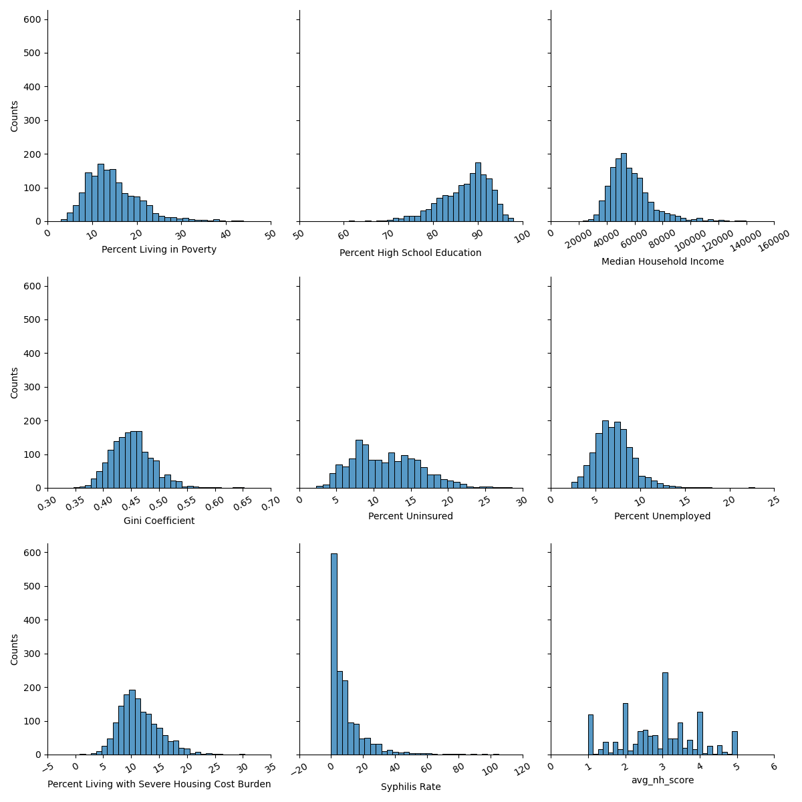

# Equitable health care

### Project partners - Group 3

* Timothy Moriarity - moriarity.t@northeastern.edu
* Mohammed Shati - shati.m@northeastern.edu


### Stakeholder

Prof. Brianne Olivieri-Mui, Dept of Health Sciences

### Story

Hundreds of millions of federal dollars have been allocated for treatment and eradication HIV. The goal of this study is to look for socioeconomic factors that could give rise to more equitable allocation of funds. The results could have implications for policy makers and government agencies administering those funds. This project builds from previous work accomplished in DS5110 students. Dr. Olivieri-Mui is very interested in seeing this work continue and ready to engage as needed!


### Data

All data is publicly available. We have included the necessary files in the data folder of the repo to save time in recreation.

The data can be obtained from the list of links found in the data.md file in the docs folder.

The necessary data can be recreated with the following command:

```
make data
```

### Model

Building off the work done by the previous groups we were able to run a linear regression model with the key feature of interest being the nursing home rating.

We are looking to see if the rating of an areas nursing homes has an impact on HIV infections.
```
make model
```
Creates figures & results.
```

Linear Regression - Full Population

                                      OLS Regression Results
==================================================================================================
Dep. Variable:     Rates of Persons Living with HIV, 2020   R-squared:                       0.006
Model:                                                OLS   Adj. R-squared:                  0.006
Method:                                     Least Squares   F-statistic:                     131.4
Date:                                    Mon, 07 Aug 2023   Prob (F-statistic):          7.58e-221
Time:                                            22:43:23   Log-Likelihood:            -1.1207e+06
No. Observations:                                  168379   AIC:                         2.241e+06
Df Residuals:                                      168370   BIC:                         2.241e+06
Df Model:                                               8
Covariance Type:                                nonrobust
==================================================================================================================
                                                     coef    std err          t      P>|t|      [0.025      0.975]
------------------------------------------------------------------------------------------------------------------
Percent Living in Poverty                          2.2038      0.189     11.636      0.000       1.833       2.575
Percent High School Education                      0.3652      0.078      4.700      0.000       0.213       0.518
Median Household Income                            0.0010   5.95e-05     16.865      0.000       0.001       0.001
Gini Coefficient                                 100.5951     17.472      5.757      0.000      66.350     134.841
Percent Uninsured                                  0.1482      0.117      1.263      0.207      -0.082       0.378
Percent Unemployed                                 1.7285      0.251      6.887      0.000       1.237       2.220
Percent Living with Severe Housing Cost Burden     0.9847      0.174      5.666      0.000       0.644       1.325
Syphilis Rate                                      0.2495      0.050      4.956      0.000       0.151       0.348
avg_nh_score                                      -8.0424      0.461    -17.446      0.000      -8.946      -7.139
==============================================================================
Omnibus:                   117034.545   Durbin-Watson:                   0.158
Prob(Omnibus):                  0.000   Jarque-Bera (JB):          2470338.299
Skew:                           3.102   Prob(JB):                         0.00
Kurtosis:                      20.710   Cond. No.                     2.22e+06
==============================================================================

Notes:
[1] Standard Errors assume that the covariance matrix of the errors is correctly specified.
[2] The condition number is large, 2.22e+06. This might indicate that there are
strong multicollinearity or other numerical problems.

 Cross-validated R^2: 0.0060534304566499

Ranked features by Lasso:

Percent Living in Poverty                         0.895944
Syphilis Rate                                     0.376102
Percent Living with Severe Housing Cost Burden    0.288201
Median Household Income                           0.000449
Percent High School Education                     0.000000
Gini Coefficient                                  0.000000
Percent Uninsured                                 0.000000
Percent Unemployed                                0.000000
avg_nh_score                                      0.000000
dtype: float64
```


```
make m55
```
Creates a model with only 55+ age group.

```
Linear Regression - 55+ Population

                            OLS Regression Results
==============================================================================
Dep. Variable:                 hiv55+   R-squared:                       0.012
Model:                            OLS   Adj. R-squared:                  0.012
Method:                 Least Squares   F-statistic:                     247.7
Date:                Mon, 07 Aug 2023   Prob (F-statistic):               0.00
Time:                        23:22:43   Log-Likelihood:            -1.0961e+06
No. Observations:              168373   AIC:                         2.192e+06
Df Residuals:                  168364   BIC:                         2.192e+06
Df Model:                           8
Covariance Type:            nonrobust
==================================================================================================================
                                                     coef    std err          t      P>|t|      [0.025      0.975]
------------------------------------------------------------------------------------------------------------------
Percent Living in Poverty                          0.8931      0.164      5.455      0.000       0.572       1.214
Percent High School Education                      0.1439      0.067      2.143      0.032       0.012       0.276
Median Household Income                            0.0008   5.15e-05     15.484      0.000       0.001       0.001
Gini Coefficient                                  62.7744     15.102      4.157      0.000      33.175      92.374
Percent Uninsured                                  0.0184      0.101      0.182      0.856      -0.180       0.217
Percent Unemployed                                 2.8759      0.217     13.257      0.000       2.451       3.301
Percent Living with Severe Housing Cost Burden     1.2710      0.150      8.461      0.000       0.977       1.565
Syphilis Rate                                      0.3221      0.044      7.401      0.000       0.237       0.407
avg_nh_score                                     -12.8997      0.398    -32.377      0.000     -13.681     -12.119
==============================================================================
Omnibus:                   105098.061   Durbin-Watson:                   1.909
Prob(Omnibus):                  0.000   Jarque-Bera (JB):          1735423.497
Skew:                           2.741   Prob(JB):                         0.00
Kurtosis:                      17.741   Cond. No.                     2.22e+06
==============================================================================

Notes:
[1] Standard Errors assume that the covariance matrix of the errors is correctly specified.
[2] The condition number is large, 2.22e+06. This might indicate that there are
strong multicollinearity or other numerical problems.
Cross-validated R^2: 0.011645046654678281
Ranked features by Lasso:
Syphilis Rate                                     0.189570
Median Household Income                           0.000289
Percent Living in Poverty                         0.000000
Percent High School Education                     0.000000
Gini Coefficient                                  0.000000
Percent Uninsured                                 0.000000
Percent Unemployed                                0.000000
Percent Living with Severe Housing Cost Burden    0.000000
avg_nh_score                                      0.000000
dtype: float64
```


### Referencing

sources.md in src folder

##### We are building off the work of two previous groups.

##### Every file will have a reference to where it originated, and if it has been modified or not. 
##### This will be done by a reference to the group at the bottom of every file.

#### Group 1
* Nick Barnes
* Paige Norris
* https://github.com/ds5110/bioscience

#### Group 2 
* Amanda Haskell
* Mian Wang
* Nicholas Letarte
* https://github.com/ds5110/projects-spring-2023-ahaskell83/tree/main


Group 3