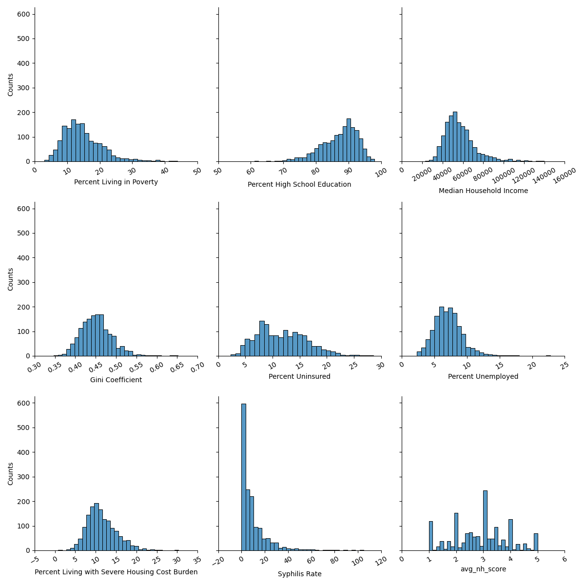

This project built off the work of two previous groups. The first issue we encountered was creating a pipeline of transparent code to reproduce the datasets the other groups had created. This involved tracking down where intial files were downloaded from, and in some cases created from all of which can be found in docs/sources.md

The Histogram below gives a look at the distributions of the features.

Based on our hypothesis we ran a basic linear regression model on the whole dataset with the included list of features seen in the summary table below.

The model did not do well. This is seen in our R-squared score of 0.006

Though we did find it surprising that so many of the features were so strongly significant.

Linear Regression - Full Population
'''
                                      OLS Regression Results
==================================================================================================
Dep. Variable:     Rates of Persons Living with HIV, 2020   R-squared:                       0.006
Model:                                                OLS   Adj. R-squared:                  0.006
Method:                                     Least Squares   F-statistic:                     131.4
Date:                                    Mon, 07 Aug 2023   Prob (F-statistic):          7.58e-221
Time:                                            22:43:23   Log-Likelihood:            -1.1207e+06
No. Observations:                                  168379   AIC:                         2.241e+06
Df Residuals:                                      168370   BIC:                         2.241e+06
Df Model:                                               8
Covariance Type:                                nonrobust
==================================================================================================================
                                                     coef    std err          t      P>|t|      [0.025      0.975]
------------------------------------------------------------------------------------------------------------------
Percent Living in Poverty                          2.2038      0.189     11.636      0.000       1.833       2.575
Percent High School Education                      0.3652      0.078      4.700      0.000       0.213       0.518
Median Household Income                            0.0010   5.95e-05     16.865      0.000       0.001       0.001
Gini Coefficient                                 100.5951     17.472      5.757      0.000      66.350     134.841
Percent Uninsured                                  0.1482      0.117      1.263      0.207      -0.082       0.378
Percent Unemployed                                 1.7285      0.251      6.887      0.000       1.237       2.220
Percent Living with Severe Housing Cost Burden     0.9847      0.174      5.666      0.000       0.644       1.325
Syphilis Rate                                      0.2495      0.050      4.956      0.000       0.151       0.348
avg_nh_score                                      -8.0424      0.461    -17.446      0.000      -8.946      -7.139
==============================================================================
Omnibus:                   117034.545   Durbin-Watson:                   0.158
Prob(Omnibus):                  0.000   Jarque-Bera (JB):          2470338.299
Skew:                           3.102   Prob(JB):                         0.00
Kurtosis:                      20.710   Cond. No.                     2.22e+06
==============================================================================

Notes:
[1] Standard Errors assume that the covariance matrix of the errors is correctly specified.
[2] The condition number is large, 2.22e+06. This might indicate that there are
strong multicollinearity or other numerical problems.
'''

We then got a averaged Rsquared score from a 10 fold cross-validation of our model shown below.

Cross-validated R^2: 0.0060534304566499

Finally we used a Lasso feature reduction with a 10 fold cross-validation, the results of which are below.

Ranked features by Lasso:

Percent Living in Poverty                         0.895944
Syphilis Rate                                     0.376102
Percent Living with Severe Housing Cost Burden    0.288201
Median Household Income                           0.000449
Percent High School Education                     0.000000
Gini Coefficient                                  0.000000
Percent Uninsured                                 0.000000
Percent Unemployed                                0.000000
avg_nh_score                                      0.000000
dtype: float64

This shows that following the use of Lasso cross-validation our feature of interest, avg_nh_score, is the least relavent. 

We repeated the same modeling and cross-validation with an abbreviated dataset looking at only populations about 55 years old.

'''

Linear Regression - 55+ Population

                            OLS Regression Results
==============================================================================
Dep. Variable:                 hiv55+   R-squared:                       0.012
Model:                            OLS   Adj. R-squared:                  0.012
Method:                 Least Squares   F-statistic:                     247.7
Date:                Mon, 07 Aug 2023   Prob (F-statistic):               0.00
Time:                        23:22:43   Log-Likelihood:            -1.0961e+06
No. Observations:              168373   AIC:                         2.192e+06
Df Residuals:                  168364   BIC:                         2.192e+06
Df Model:                           8
Covariance Type:            nonrobust
==================================================================================================================
                                                     coef    std err          t      P>|t|      [0.025      0.975]
------------------------------------------------------------------------------------------------------------------
Percent Living in Poverty                          0.8931      0.164      5.455      0.000       0.572       1.214
Percent High School Education                      0.1439      0.067      2.143      0.032       0.012       0.276
Median Household Income                            0.0008   5.15e-05     15.484      0.000       0.001       0.001
Gini Coefficient                                  62.7744     15.102      4.157      0.000      33.175      92.374
Percent Uninsured                                  0.0184      0.101      0.182      0.856      -0.180       0.217
Percent Unemployed                                 2.8759      0.217     13.257      0.000       2.451       3.301
Percent Living with Severe Housing Cost Burden     1.2710      0.150      8.461      0.000       0.977       1.565
Syphilis Rate                                      0.3221      0.044      7.401      0.000       0.237       0.407
avg_nh_score                                     -12.8997      0.398    -32.377      0.000     -13.681     -12.119
==============================================================================
Omnibus:                   105098.061   Durbin-Watson:                   1.909
Prob(Omnibus):                  0.000   Jarque-Bera (JB):          1735423.497
Skew:                           2.741   Prob(JB):                         0.00
Kurtosis:                      17.741   Cond. No.                     2.22e+06
==============================================================================

Notes:
[1] Standard Errors assume that the covariance matrix of the errors is correctly specified.
[2] The condition number is large, 2.22e+06. This might indicate that there are
strong multicollinearity or other numerical problems.

'''
Cross-validated R^2: 0.011645046654678281

Ranked features by Lasso:

Syphilis Rate                                     0.189570
Median Household Income                           0.000289
Percent Living in Poverty                         0.000000
Percent High School Education                     0.000000
Gini Coefficient                                  0.000000
Percent Uninsured                                 0.000000
Percent Unemployed                                0.000000
Percent Living with Severe Housing Cost Burden    0.000000
avg_nh_score                                      0.000000
dtype: float64

###
This model found Syphilis rate to be a stronger feature the Percent Living in Poverty, which was the top feature after lasso in the previous model using the entire population. Unfortunately both models found the avg_nh_score to be the least important of the features. 

This can likely be contributed to a couple of different factors. Firstly the nursing home score itself has its own issue as a metric of measure for one of our features. As it is a generated metric there may be variables that go into its creation that would be better suited for this modeling. 

https://www.cms.gov/Medicare/Provider-Enrollment-and-Certification/CertificationandComplianc/downloads/usersguide.pdf

This has the technical details of the scores used for nursing home rating and there maybe a better metric for evaluating nursing homes relative to HIV prevalence, for future modeling.

