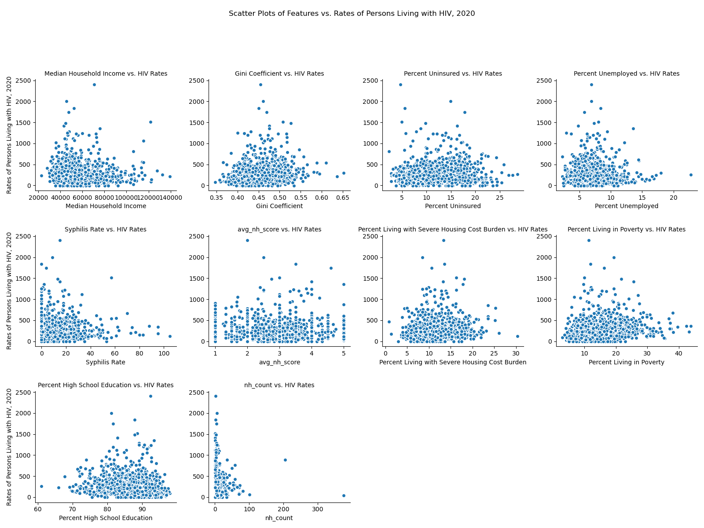
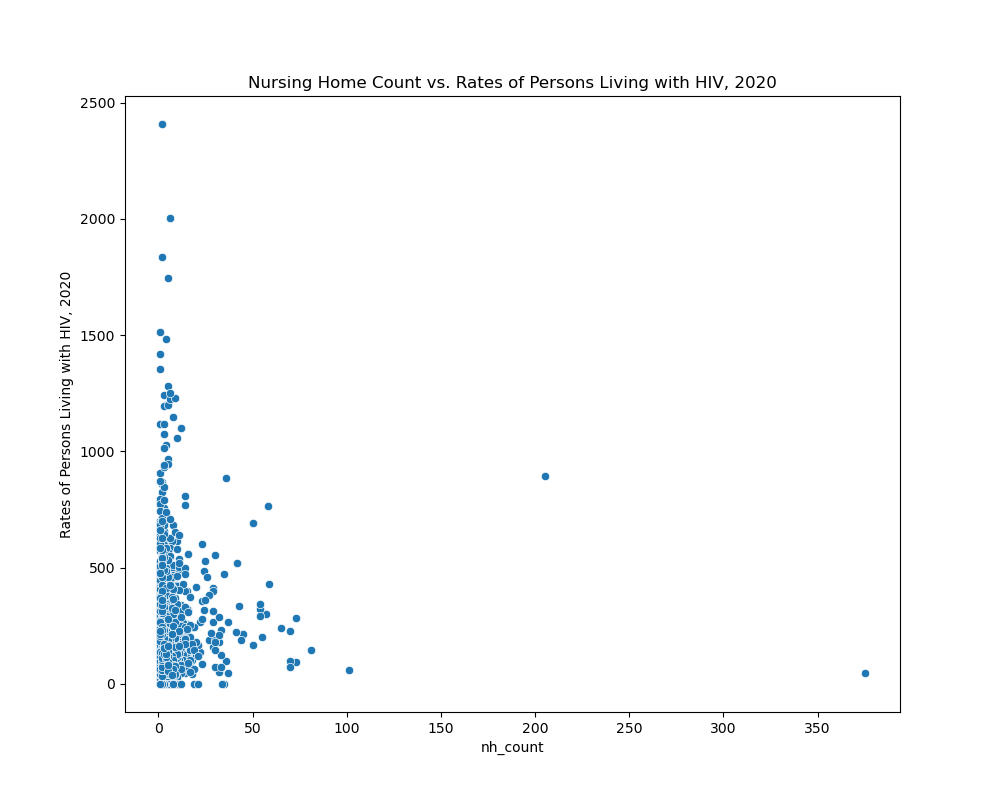
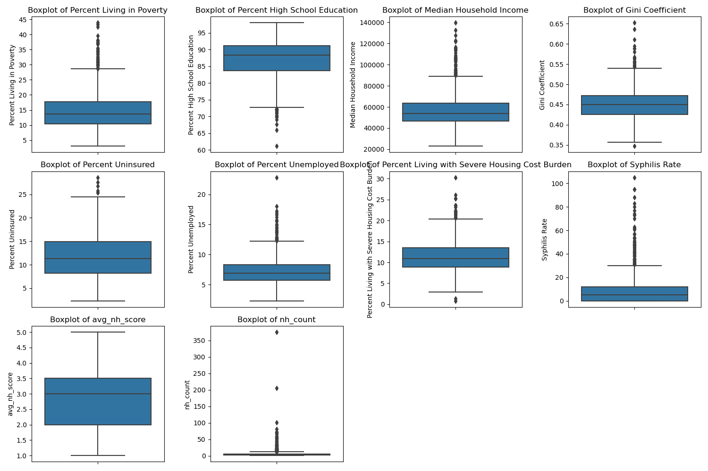
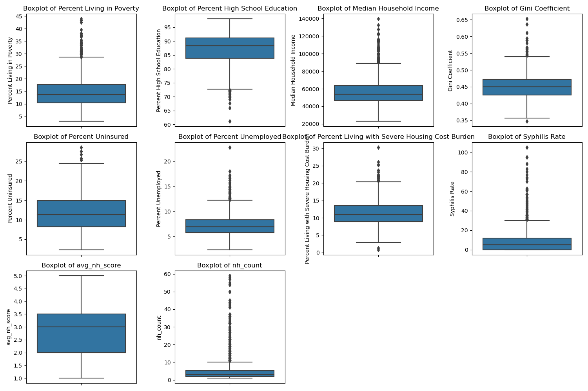
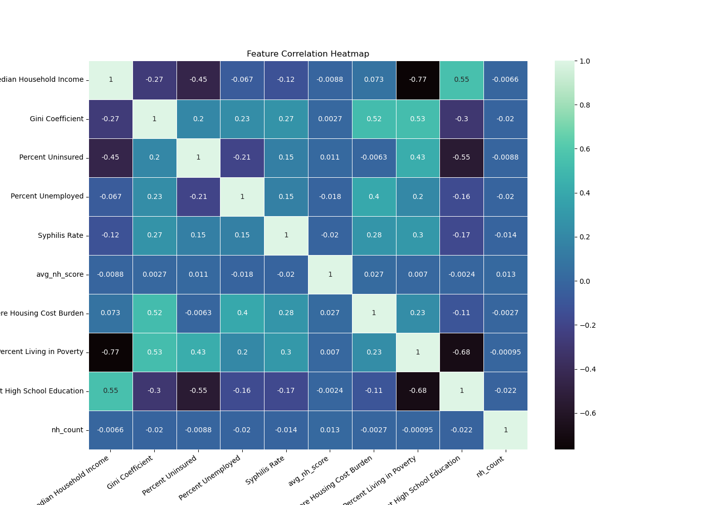
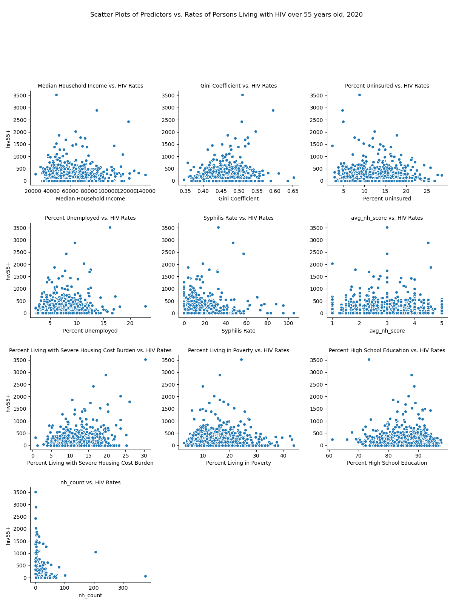

#### Stakeholder

Prof. Brianne Olivieri-Mui, Dept of Health Sciences

#### Project partners - Group 3

* Timothy Moriarity - moriarity.t@northeastern.edu
* Mohammed Shati - shati.m@northeastern.edu

### Story 

HIV and aids is a significant public health issue that has resulted in the deaths of millions of people. Medicaid is the only public insurance that pays for nursing home care. A significant portion of people living with HIV (PLWH) have Medicaid, many are also dually eligible for Medicare. Having Medicaid or Medicare means access to Part D prescription drug coverage which is mandated to cover HIV medications (they are one of the 6 protected classes of drugs). Nursing homes however do not keep these drugs on formulary because they are relatively rare and is potentially contributing to issues with antiretroviral therapy (ART) adherence in this setting. There exists publicly available data provided by Medicare.gov that ranks nursing homes on a star rating from 1 to 5, with 1 indicating the worst care and 5 indicating the best care. This was used in Group 2s work on visualizing nursing home score and HIV prevalence.

For this reason we are looking for a relationship between the ratings of an areas nursing homes and the prevelance of HIV in that area.

Based on this hypothesis we are looking at what if any relationship there is between a nursing home ratings and the prevelance of HIV in an area. We have a hypothesis that the higher the ratings of nursing homes in an area the lower the prevalence of HIV. If this holds true, this would support the allocation of public funds to combat HIV by raising the quality of nursing home care.


This project built off the work of two previous groups. The first issue we encountered was creating a pipeline of transparent code to reproduce the datasets the other groups had created. This involved tracking down where intial files were downloaded from, and in some cases created from all of which can be found in docs/sources.md


Based on our hypothesis we ran a basic linear regression model on the whole dataset with the included list of features seen in the summary table below.


### Data

All data is publicly available. We have included the necessary files in the data folder of the repo to save time in recreation.

The data can be obtained from the list of links found in the sources.md file in the docs folder.

The necessary data can be recreated with the following command:

```
make data
```
### EDA

```
make plots
```
This scatter plot gives us a look at available features
as well as our feature of interest average nursing home score
compared with HIV prevalence rates:



Based on the feature scatter plot, we examined the outliers in the nh_count feature.
We were able to identify them as counties with major cities as expected.

Cut1: LA & Chicago

Cut2: San Diego & Houston

Cut3: San Franscisco, Cincinnati, Boston, St. Louis, Detroit

The command below goes through a progression of outlier removal.
Both identifying the cities and replotting.
By our final cut the nursing home counts data is far less skewed.

```
make outliers
```
With outliers:



Without outliers:


This histogram shows the distributions of the features:


The feature of interest average nursing home score looks relatively normally distributed.
A good sign.

This shows the outliers in the features:

Before cities drop:



After cities drop:



The distribution of nursing home counts looks better.

This shows any correlation amongst the features:



Appears to be some interaction between the income related variables.
May warrant further examination.

### Model

Building off the work done by the previous groups we were able to run a linear regression model with the key feature of interest being nursing home ratings.

We are looking to see if the rating of an areas nursing homes has an impact on HIV infections.
This runs our most basic model, using the full dataset with average nursing home score amongst the features.
```
make model
```

### Model 1 - Full Population

#### Feature Selection Forward & Backward w/ Sequential Feature Selector (SFS)

Looking at the order features are chosen by the SFS

This is the result from the first file of the make model command:

```
First Feature Selected by Forward Selection:

 ['Gini Coefficient']

First 2 Features Selected by Forward Selection:

 ['Percent High School Education' 'Gini Coefficient']

First 3 Features Selected by Forward Selection:

 ['Percent High School Education' 'Median Household Income'
 'Gini Coefficient']

First 4 Features Selected by Forward Selection:

 ['Percent Living in Poverty' 'Percent High School Education'
 'Median Household Income' 'Gini Coefficient']

First 5 Features Selected by Forward Selection:

 ['Percent Living in Poverty' 'Percent High School Education'
 'Median Household Income' 'Gini Coefficient' 'Percent Unemployed']

First 6 Features Selected by Forward Selection:

 ['Percent Living in Poverty' 'Percent High School Education'
 'Median Household Income' 'Gini Coefficient' 'Percent Unemployed'
 'Percent Living with Severe Housing Cost Burden']

First 7 Features Selected by Forward Selection:

 ['Percent Living in Poverty' 'Percent High School Education'
 'Median Household Income' 'Gini Coefficient' 'Percent Unemployed'
 'Percent Living with Severe Housing Cost Burden' 'avg_nh_score']

First 8 Features Selected by Forward Selection:

 ['Percent Living in Poverty' 'Percent High School Education'
 'Median Household Income' 'Gini Coefficient' 'Percent Unemployed'
 'Percent Living with Severe Housing Cost Burden' 'Syphilis Rate'
 'avg_nh_score']


Unfortunately avg_nh_score is the 7th feature selected.


First Feature Selected by Backward Selection:

 ['Percent Living in Poverty']

First 2 Features Selected by Backward Selection:

 ['Percent Living in Poverty' 'Median Household Income']

First 3 Features Selected by Backward Selection:

 ['Percent Living in Poverty' 'Median Household Income' 'Gini Coefficient']

First 4 Features Selected by Backward Selection:

 ['Percent Living in Poverty' 'Percent High School Education'
 'Median Household Income' 'Gini Coefficient']

First 5 Features Selected by Backward Selection:

 ['Percent Living in Poverty' 'Percent High School Education'
 'Median Household Income' 'Gini Coefficient' 'Percent Unemployed']

First 6 Features Selected by Backward Selection:

 ['Percent Living in Poverty' 'Percent High School Education'
 'Median Household Income' 'Gini Coefficient' 'Percent Unemployed'
 'Percent Living with Severe Housing Cost Burden']

First 7 Features Selected by Backward Selection:

 ['Percent Living in Poverty' 'Percent High School Education'
 'Median Household Income' 'Gini Coefficient' 'Percent Unemployed'
 'Percent Living with Severe Housing Cost Burden' 'avg_nh_score']

First 8 Features Selected by Backward Selection:

 ['Percent Living in Poverty' 'Percent High School Education'
 'Median Household Income' 'Gini Coefficient' 'Percent Unemployed'
 'Percent Living with Severe Housing Cost Burden' 'Syphilis Rate'
 'avg_nh_score']
```
This is the result from the second file of the make model command:

Linear Regression - Full Population

```

                                      OLS Regression Results
==================================================================================================
Dep. Variable:     Rates of Persons Living with HIV, 2020   R-squared:                       0.086
Model:                                                OLS   Adj. R-squared:                  0.081
Method:                                     Least Squares   F-statistic:                     17.32
Date:                                    Sun, 13 Aug 2023   Prob (F-statistic):           8.02e-25
Time:                                            13:52:47   Log-Likelihood:                -10036.
No. Observations:                                    1478   AIC:                         2.009e+04
Df Residuals:                                        1469   BIC:                         2.014e+04
Df Model:                                               8
Covariance Type:                                nonrobust
==================================================================================================================
                                                     coef    std err          t      P>|t|      [0.025      0.975]
------------------------------------------------------------------------------------------------------------------
Percent Living in Poverty                          6.9459      1.824      3.807      0.000       3.367      10.524
Percent High School Education                     -4.1979      0.812     -5.171      0.000      -5.790      -2.606
Median Household Income                            0.0030      0.001      4.828      0.000       0.002       0.004
Gini Coefficient                                 668.5884    192.331      3.476      0.001     291.315    1045.862
Percent Uninsured                                  2.8547      1.455      1.962      0.050       0.001       5.709
Percent Unemployed                                -7.3420      2.911     -2.522      0.012     -13.052      -1.632
Percent Living with Severe Housing Cost Burden     3.9185      2.005      1.955      0.051      -0.014       7.851
Syphilis Rate                                      0.1380      0.502      0.275      0.783      -0.846       1.122
avg_nh_score                                       2.9649      5.533      0.536      0.592      -7.889      13.819
==============================================================================
Omnibus:                     1073.939   Durbin-Watson:                   1.734
Prob(Omnibus):                  0.000   Jarque-Bera (JB):            21878.153
Skew:                           3.181   Prob(JB):                         0.00
Kurtosis:                      20.742   Cond. No.                     2.01e+06
==============================================================================

Notes:
[1] Standard Errors assume that the covariance matrix of the errors is correctly specified.
[2] The condition number is large, 2.01e+06. This might indicate that there are
strong multicollinearity or other numerical problems.
```

##### Cross Validation - 5 Fold
```
Cross-validated R^2: 0.07248325675585485
```
The model did not do well. This is seen in our R-squared score of 0.086, cross-validated to 0.072.

##### Lasso Rankings
```
Ranked features by Lasso:

Percent Living in Poverty                         3.995628
Syphilis Rate                                     0.424319
Median Household Income                           0.000613
Percent High School Education                     0.000000
Gini Coefficient                                  0.000000
Percent Uninsured                                 0.000000
Percent Unemployed                                0.000000
Percent Living with Severe Housing Cost Burden    0.000000
avg_nh_score                                      0.000000
dtype: float64
```

Average Nursing Home Score is not statistically significant along with being ranked last using Lasso feature selection.
This is not an overly surprising finding as this includes a larger population many of which are likely not impacted by nursing home care.

### Model 2 - 55+ Population
We repeated the same modeling and cross-validation with an abbreviated dataset looking at only populations above 55 years old.
Hypothesizing that nursing home score would be more relevant to an older population.

Below creates scatterplots of the features compared with HIV rates in those older than 55
```
make scatter55
```


creates the same model as before using only rates of those older than 55:

```
make m55
```
#### Feature Selection Forward & Backward w/ Sequential Feature Selector (SFS)

Looking at the order features are chosen by the SFS

This is the result from the first file of the make m55 command:

```
First Feature Selected by Forward Selection:

 ['Percent Living with Severe Housing Cost Burden']

First 2 Features Selected by Forward Selection:

 ['Median Household Income'
 'Percent Living with Severe Housing Cost Burden']

First 3 Features Selected by Forward Selection:

 ['Percent High School Education' 'Median Household Income'
 'Percent Living with Severe Housing Cost Burden']

First 4 Features Selected by Forward Selection:

 ['Percent Living in Poverty' 'Percent High School Education'
 'Median Household Income'
 'Percent Living with Severe Housing Cost Burden']

First 5 Features Selected by Forward Selection:

 ['Percent Living in Poverty' 'Percent High School Education'
 'Median Household Income' 'Gini Coefficient'
 'Percent Living with Severe Housing Cost Burden']

First 6 Features Selected by Forward Selection:

 ['Percent Living in Poverty' 'Percent High School Education'
 'Median Household Income' 'Gini Coefficient' 'Percent Uninsured'
 'Percent Living with Severe Housing Cost Burden']

First 7 Features Selected by Forward Selection:

 ['Percent Living in Poverty' 'Percent High School Education'
 'Median Household Income' 'Gini Coefficient' 'Percent Uninsured'
 'Percent Living with Severe Housing Cost Burden' 'avg_nh_score']

First 8 Features Selected by Forward Selection:

 ['Percent Living in Poverty' 'Percent High School Education'
 'Median Household Income' 'Gini Coefficient' 'Percent Uninsured'
 'Percent Unemployed' 'Percent Living with Severe Housing Cost Burden'
 'avg_nh_score']

First Feature Selected by Backward Selection:

 ['Percent Living with Severe Housing Cost Burden']

First 2 Features Selected by Backward Selection:

 ['Median Household Income'
 'Percent Living with Severe Housing Cost Burden']

First 3 Features Selected by Backward Selection:

 ['Percent High School Education' 'Median Household Income'
 'Percent Living with Severe Housing Cost Burden']

First 4 Features Selected by Backward Selection:

 ['Percent Living in Poverty' 'Percent High School Education'
 'Median Household Income'
 'Percent Living with Severe Housing Cost Burden']

First 5 Features Selected by Backward Selection:

 ['Percent Living in Poverty' 'Percent High School Education'
 'Median Household Income' 'Gini Coefficient'
 'Percent Living with Severe Housing Cost Burden']

First 6 Features Selected by Backward Selection:

 ['Percent Living in Poverty' 'Percent High School Education'
 'Median Household Income' 'Gini Coefficient' 'Percent Uninsured'
 'Percent Living with Severe Housing Cost Burden']

First 7 Features Selected by Backward Selection:

 ['Percent Living in Poverty' 'Percent High School Education'
 'Median Household Income' 'Gini Coefficient' 'Percent Uninsured'
 'Percent Living with Severe Housing Cost Burden' 'avg_nh_score']

First 8 Features Selected by Backward Selection:

 ['Percent Living in Poverty' 'Percent High School Education'
 'Median Household Income' 'Gini Coefficient' 'Percent Uninsured'
 'Percent Unemployed' 'Percent Living with Severe Housing Cost Burden'
 'avg_nh_score']
```
This is the result from the second file of the make m55 command:

Linear Regression - 55+ Population
```

                            OLS Regression Results
==============================================================================
Dep. Variable:                 hiv55+   R-squared:                       0.138
Model:                            OLS   Adj. R-squared:                  0.134
Method:                 Least Squares   F-statistic:                     29.47
Date:                Sun, 13 Aug 2023   Prob (F-statistic):           6.00e-43
Time:                        14:56:46   Log-Likelihood:                -10239.
No. Observations:                1478   AIC:                         2.050e+04
Df Residuals:                    1469   BIC:                         2.054e+04
Df Model:                           8
Covariance Type:            nonrobust
==================================================================================================================
                                                     coef    std err          t      P>|t|      [0.025      0.975]
------------------------------------------------------------------------------------------------------------------
Percent Living in Poverty                          2.5241      2.093      1.206      0.228      -1.581       6.630
Percent High School Education                     -6.0130      0.931     -6.456      0.000      -7.840      -4.186
Median Household Income                            0.0043      0.001      6.050      0.000       0.003       0.006
Gini Coefficient                                 427.2252    220.656      1.936      0.053      -5.610     860.060
Percent Uninsured                                  1.7192      1.669      1.030      0.303      -1.555       4.993
Percent Unemployed                                 0.9388      3.339      0.281      0.779      -5.612       7.489
Percent Living with Severe Housing Cost Burden    15.7221      2.300      6.836      0.000      11.211      20.234
Syphilis Rate                                      1.8257      0.576      3.171      0.002       0.696       2.955
avg_nh_score                                       1.2603      6.348      0.199      0.843     -11.192      13.713
==============================================================================
Omnibus:                     1249.711   Durbin-Watson:                   2.008
Prob(Omnibus):                  0.000   Jarque-Bera (JB):            47792.481
Skew:                           3.731   Prob(JB):                         0.00
Kurtosis:                      29.840   Cond. No.                     2.01e+06
==============================================================================

Notes:
[1] Standard Errors assume that the covariance matrix of the errors is correctly specified.
[2] The condition number is large, 2.01e+06. This might indicate that there are
strong multicollinearity or other numerical problems.
```
##### Cross Validation - 5 Fold - 55+ Population
```
Cross-validated R^2: 0.0941696682454305
```
##### Lasso Rankings - 55+ Population
```
Ranked features by Lasso:

Syphilis Rate                                     1.150892
Median Household Income                           0.002016
Percent Living in Poverty                         0.000000
Percent High School Education                     0.000000
Gini Coefficient                                  0.000000
Percent Uninsured                                 0.000000
Percent Unemployed                                0.000000
Percent Living with Severe Housing Cost Burden    0.000000
avg_nh_score                                      0.000000
dtype: float64
```
### Model 3 - Full Population  - Drop Major Cities
We repeated the same modeling and cross-validation with an abbreviated dataset looking at only populations above 55 years old.
Hypothesizing that nursing home score would be more relevant to an older population.

```
make mNC
```
#### Feature Selection Forward & Backward w/ Sequential Feature Selector (SFS)

Looking at the order features are chosen by the SFS

This is the result from the first file of the make mNC command:

```
First Feature Selected by Forward Selection:

 ['Gini Coefficient']

First 2 Features Selected by Forward Selection:

 ['Percent High School Education' 'Gini Coefficient']

First 3 Features Selected by Forward Selection:

 ['Percent High School Education' 'Median Household Income'
 'Gini Coefficient']

First 4 Features Selected by Forward Selection:

 ['Percent Living in Poverty' 'Percent High School Education'
 'Median Household Income' 'Gini Coefficient']

First 5 Features Selected by Forward Selection:

 ['Percent Living in Poverty' 'Percent High School Education'
 'Median Household Income' 'Gini Coefficient' 'Percent Unemployed']

First 6 Features Selected by Forward Selection:

 ['Percent Living in Poverty' 'Percent High School Education'
 'Median Household Income' 'Gini Coefficient' 'Percent Unemployed'
 'Percent Living with Severe Housing Cost Burden']

First 7 Features Selected by Forward Selection:

 ['Percent Living in Poverty' 'Percent High School Education'
 'Median Household Income' 'Gini Coefficient' 'Percent Unemployed'
 'Percent Living with Severe Housing Cost Burden' 'avg_nh_score']

First 8 Features Selected by Forward Selection:

 ['Percent Living in Poverty' 'Percent High School Education'
 'Median Household Income' 'Gini Coefficient' 'Percent Unemployed'
 'Percent Living with Severe Housing Cost Burden' 'Syphilis Rate'
 'avg_nh_score']


Unfortunately avg_nh_score is the 7th feature selected.


First Feature Selected by Backward Selection:

 ['Percent Living in Poverty']

First 2 Features Selected by Backward Selection:

 ['Percent Living in Poverty' 'Median Household Income']

First 3 Features Selected by Backward Selection:

 ['Percent Living in Poverty' 'Median Household Income' 'Gini Coefficient']

First 4 Features Selected by Backward Selection:

 ['Percent Living in Poverty' 'Percent High School Education'
 'Median Household Income' 'Gini Coefficient']

First 5 Features Selected by Backward Selection:

 ['Percent Living in Poverty' 'Percent High School Education'
 'Median Household Income' 'Gini Coefficient' 'Percent Unemployed']

First 6 Features Selected by Backward Selection:

 ['Percent Living in Poverty' 'Percent High School Education'
 'Median Household Income' 'Gini Coefficient' 'Percent Unemployed'
 'Percent Living with Severe Housing Cost Burden']

First 7 Features Selected by Backward Selection:

 ['Percent Living in Poverty' 'Percent High School Education'
 'Median Household Income' 'Gini Coefficient' 'Percent Unemployed'
 'Percent Living with Severe Housing Cost Burden' 'avg_nh_score']

First 8 Features Selected by Backward Selection:

 ['Percent Living in Poverty' 'Percent High School Education'
 'Median Household Income' 'Gini Coefficient' 'Percent Unemployed'
 'Percent Living with Severe Housing Cost Burden' 'Syphilis Rate'
 'avg_nh_score']


Unfortunately avg_nh_score is the 7th feature selected. Again.
```
This is the result from the second file of the make m55 command:

Linear Regression - Full Population - after major cities drop
```

                                      OLS Regression Results
==================================================================================================
Dep. Variable:     Rates of Persons Living with HIV, 2020   R-squared:                       0.085
Model:                                                OLS   Adj. R-squared:                  0.080
Method:                                     Least Squares   F-statistic:                     16.94
Date:                                    Mon, 14 Aug 2023   Prob (F-statistic):           2.99e-24
Time:                                            14:50:18   Log-Likelihood:                -9968.3
No. Observations:                                    1468   AIC:                         1.995e+04
Df Residuals:                                        1459   BIC:                         2.000e+04
Df Model:                                               8
Covariance Type:                                nonrobust
==================================================================================================================
                                                     coef    std err          t      P>|t|      [0.025      0.975]
------------------------------------------------------------------------------------------------------------------
Percent Living in Poverty                          6.5599      1.836      3.572      0.000       2.958      10.162
Percent High School Education                     -4.2831      0.815     -5.254      0.000      -5.882      -2.684
Median Household Income                            0.0029      0.001      4.760      0.000       0.002       0.004
Gini Coefficient                                 706.8408    193.517      3.653      0.000     327.239    1086.443
Percent Uninsured                                  2.8375      1.461      1.943      0.052      -0.028       5.703
Percent Unemployed                                -7.2852      2.923     -2.492      0.013     -13.019      -1.551
Percent Living with Severe Housing Cost Burden     3.5985      2.013      1.788      0.074      -0.350       7.547
Syphilis Rate                                      0.2100      0.504      0.417      0.677      -0.778       1.198
avg_nh_score                                       3.1790      5.542      0.574      0.566      -7.693      14.051
==============================================================================
Omnibus:                     1068.926   Durbin-Watson:                   1.740
Prob(Omnibus):                  0.000   Jarque-Bera (JB):            21900.847
Skew:                           3.187   Prob(JB):                         0.00
Kurtosis:                      20.816   Cond. No.                     2.02e+06
==============================================================================

Notes:
[1] Standard Errors assume that the covariance matrix of the errors is correctly specified.
[2] The condition number is large, 2.02e+06. This might indicate that there are
strong multicollinearity or other numerical problems.
```
##### Cross Validation - 5 Fold - Full Population - Drop Major Cities

Cross-validated R^2: 0.06267729014563136

##### Lasso Rankings - Full Population - Drop Major Cities

Ranked features by Lasso:

Percent Living in Poverty                         4.253210
Syphilis Rate                                     0.497284
Percent High School Education                     0.197858
Median Household Income                           0.000776
Gini Coefficient                                  0.000000
Percent Uninsured                                 0.000000
Percent Unemployed                                0.000000
Percent Living with Severe Housing Cost Burden    0.000000
avg_nh_score                                      0.000000
dtype: float64

### Model 4 - 55+ Population - Drop Major Cities
We repeated the same modeling and cross-validation with an abbreviated dataset looking at only populations above 55 years old.
Hypothesizing that nursing home score would be more relevant to an older population.

creates the same model as before using only rates of those older than 55:

```
make mNC55
```
#### Feature Selection Forward & Backward w/ Sequential Feature Selector (SFS)

Looking at the order features are chosen by the SFS

This is the result from the first file of the make m55 command:

```
First Feature Selected by Forward Selection:

 ['Percent Living with Severe Housing Cost Burden']

First 2 Features Selected by Forward Selection:

 ['Median Household Income'
 'Percent Living with Severe Housing Cost Burden']

First 3 Features Selected by Forward Selection:

 ['Percent High School Education' 'Median Household Income'
 'Percent Living with Severe Housing Cost Burden']

First 4 Features Selected by Forward Selection:

 ['Percent Living in Poverty' 'Percent High School Education'
 'Median Household Income'
 'Percent Living with Severe Housing Cost Burden']

First 5 Features Selected by Forward Selection:

 ['Percent Living in Poverty' 'Percent High School Education'
 'Median Household Income' 'Gini Coefficient'
 'Percent Living with Severe Housing Cost Burden']

First 6 Features Selected by Forward Selection:

 ['Percent Living in Poverty' 'Percent High School Education'
 'Median Household Income' 'Gini Coefficient' 'Percent Uninsured'
 'Percent Living with Severe Housing Cost Burden']

First 7 Features Selected by Forward Selection:

 ['Percent Living in Poverty' 'Percent High School Education'
 'Median Household Income' 'Gini Coefficient' 'Percent Uninsured'
 'Percent Living with Severe Housing Cost Burden' 'avg_nh_score']

First 8 Features Selected by Forward Selection:

 ['Percent Living in Poverty' 'Percent High School Education'
 'Median Household Income' 'Gini Coefficient' 'Percent Uninsured'
 'Percent Unemployed' 'Percent Living with Severe Housing Cost Burden'
 'avg_nh_score']


Unfortunately avg_nh_score is the 7th feature selected.


First Feature Selected by Backward Selection:

 ['Percent Living with Severe Housing Cost Burden']

First 2 Features Selected by Backward Selection:

 ['Median Household Income'
 'Percent Living with Severe Housing Cost Burden']

First 3 Features Selected by Backward Selection:

 ['Percent High School Education' 'Median Household Income'
 'Percent Living with Severe Housing Cost Burden']

First 4 Features Selected by Backward Selection:

 ['Percent Living in Poverty' 'Percent High School Education'
 'Median Household Income'
 'Percent Living with Severe Housing Cost Burden']

First 5 Features Selected by Backward Selection:

 ['Percent Living in Poverty' 'Percent High School Education'
 'Median Household Income' 'Gini Coefficient'
 'Percent Living with Severe Housing Cost Burden']

First 6 Features Selected by Backward Selection:

 ['Percent Living in Poverty' 'Percent High School Education'
 'Median Household Income' 'Gini Coefficient' 'Percent Uninsured'
 'Percent Living with Severe Housing Cost Burden']

First 7 Features Selected by Backward Selection:

 ['Percent Living in Poverty' 'Percent High School Education'
 'Median Household Income' 'Gini Coefficient' 'Percent Uninsured'
 'Percent Living with Severe Housing Cost Burden' 'avg_nh_score']

First 8 Features Selected by Backward Selection:

 ['Percent Living in Poverty' 'Percent High School Education'
 'Median Household Income' 'Gini Coefficient' 'Percent Uninsured'
 'Percent Unemployed' 'Percent Living with Severe Housing Cost Burden'
 'avg_nh_score']


Unfortunately avg_nh_score is the 7th feature selected. Again.
```
This is the result from the second file of the make mNC55 command:

Linear Regression - 55+ Population - after major cities drop
```

                            OLS Regression Results
==============================================================================
Dep. Variable:                 hiv55+   R-squared:                       0.138
Model:                            OLS   Adj. R-squared:                  0.133
Method:                 Least Squares   F-statistic:                     29.19
Date:                Mon, 14 Aug 2023   Prob (F-statistic):           1.64e-42
Time:                        14:55:30   Log-Likelihood:                -10168.
No. Observations:                1468   AIC:                         2.035e+04
Df Residuals:                    1459   BIC:                         2.040e+04
Df Model:                           8
Covariance Type:            nonrobust
==================================================================================================================
                                                     coef    std err          t      P>|t|      [0.025      0.975]
------------------------------------------------------------------------------------------------------------------
Percent Living in Poverty                          2.0260      2.104      0.963      0.336      -2.101       6.153
Percent High School Education                     -6.1403      0.934     -6.574      0.000      -7.972      -4.308
Median Household Income                            0.0042      0.001      6.013      0.000       0.003       0.006
Gini Coefficient                                 479.2434    221.727      2.161      0.031      44.305     914.182
Percent Uninsured                                  1.5968      1.674      0.954      0.340      -1.686       4.880
Percent Unemployed                                 1.1958      3.349      0.357      0.721      -5.374       7.765
Percent Living with Severe Housing Cost Burden    15.2133      2.306      6.596      0.000      10.689      19.738
Syphilis Rate                                      1.8984      0.577      3.290      0.001       0.766       3.030
avg_nh_score                                       1.4398      6.350      0.227      0.821     -11.017      13.896
==============================================================================
Omnibus:                     1246.847   Durbin-Watson:                   2.013
Prob(Omnibus):                  0.000   Jarque-Bera (JB):            48433.240
Skew:                           3.750   Prob(JB):                         0.00
Kurtosis:                      30.121   Cond. No.                     2.02e+06
==============================================================================

Notes:
[1] Standard Errors assume that the covariance matrix of the errors is correctly specified.
[2] The condition number is large, 2.02e+06. This might indicate that there are
strong multicollinearity or other numerical problems.
```

##### Cross Validation - 5 Fold - 55+ Population  - Drop Major Cities

 Cross-validated R^2: 0.09603797781271266

##### Lasso Rankings - 55+ Population  - Drop Major Cities

Ranked features by Lasso:

Syphilis Rate                                     1.059828
Median Household Income                           0.002095
Percent Living in Poverty                         0.000000
Percent High School Education                     0.000000
Gini Coefficient                                  0.000000
Percent Uninsured                                 0.000000
Percent Unemployed                                0.000000
Percent Living with Severe Housing Cost Burden    0.000000
avg_nh_score                                      0.000000
dtype: float64

This model found Syphilis rate to be a stronger feature the Percent Living in Poverty, which was the top feature after lasso in the previous model using the entire population. Unfortunately both models found the avg_nh_score to be the least important of the features by Lasso. 

This can likely be contributed to a couple of different factors. Firstly the nursing home score itself has its own issue as a metric of measure for one of our features. As it is a generated metric there may be variables that go into its creation that would be better suited for this modeling. 

https://www.cms.gov/Medicare/Provider-Enrollment-and-Certification/CertificationandComplianc/downloads/usersguide.pdf

This has the technical details of the scores used for nursing home rating and there maybe a better metric for evaluating nursing homes relative to HIV prevalence, for future modeling.
